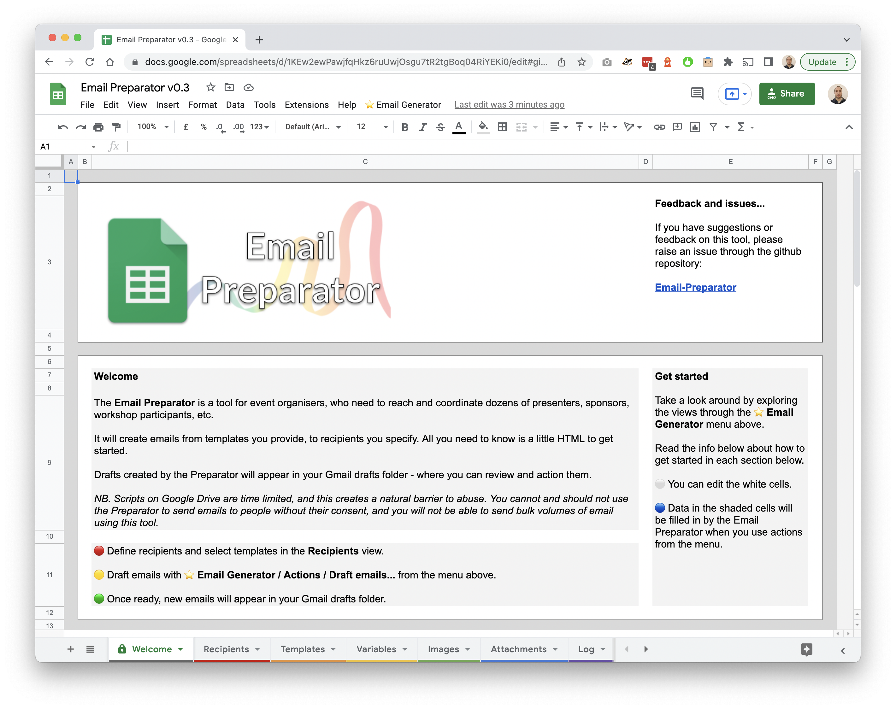

# Email Preparator

The __Email Preparator__ is a tool for event organisers who may need to reach and coordinate dozens of presenters, sponsors, workshop participants, etc.

It's a __Google Sheet__ that interacts with your __Gmail__ and __Drive__ accounts to build emails from templates.

Features supported:

* Templates with variable substitution
* Global variables
* Variables per recipient
* Attachments
* Inline images

Drafts created by the Email Preparator will appear in your Gmail drafts folder - where you can review and action them.

The Email Preparator is provided free, and as-is, for your personal use.

It's a tool I use personally, and I'll occasionally update it. When I do, I'll create a new version and update this README.

## Get started

Make a copy for your own use for free:

* [Email Preparator v0.4](https://docs.google.com/spreadsheets/d/1gI-Qh_bYGj_kYiuQa1AKvILjeoWEAt8oXhwM3fRggZA/copy)

Full instructions are included in the __Welcome__ sheet.

_NB. Scripts on Google Drive are time limited, and this creates a natural barrier to abuse. You cannot and should not use the Preparator to send emails to people without their consent, and you will not be able to send bulk volumes of email using this tool._

## Changelog

| Version  | Changes |
| ------------- | ------------- |
| 0.1 | Initial release with support for Recipients, Templates, Variables, Attachments, Drafting Logging. |
| 0.2 | Assorted minor improvements. |
| 0.3 | Enhances attachment support, automatic attachments using a drive folder as the source, automatic inline images by referring to them with cid references within the template. |
| 0.4 | Adds support for multiple recipient emails, recipient CCs, and template CCs. |

### Previous versions

* [Email Preparator v0.1](https://docs.google.com/spreadsheets/d/18v8caw4R5WscY6k8qZ73LuBmX0iTQ-jouKjcf9YRnVw/copy)
* [Email Preparator v0.2](https://docs.google.com/spreadsheets/d/1dRD1mYxWgdFJl4dIBJMKFa339auvbErk6XtT8qjlq0o/copy)
* [Email Preparator v0.3](https://docs.google.com/spreadsheets/d/1KEw2ewPawjfqHkz6ruUwjOsgu7tR2tgBoq04RiYEKi0/copy)

### Issues and feedback

Please record feedback using [Issues](https://github.com/instantiator/Email-Preparator/issues) for this repository.
